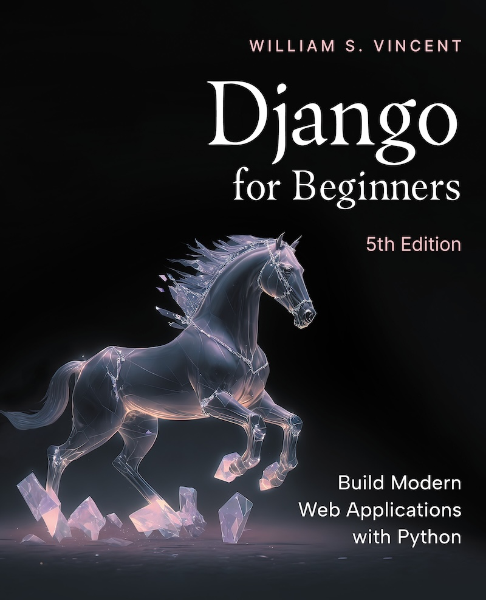
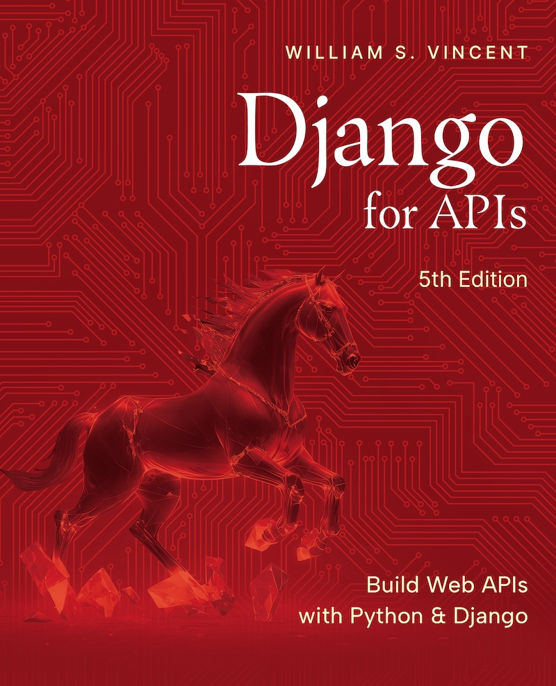
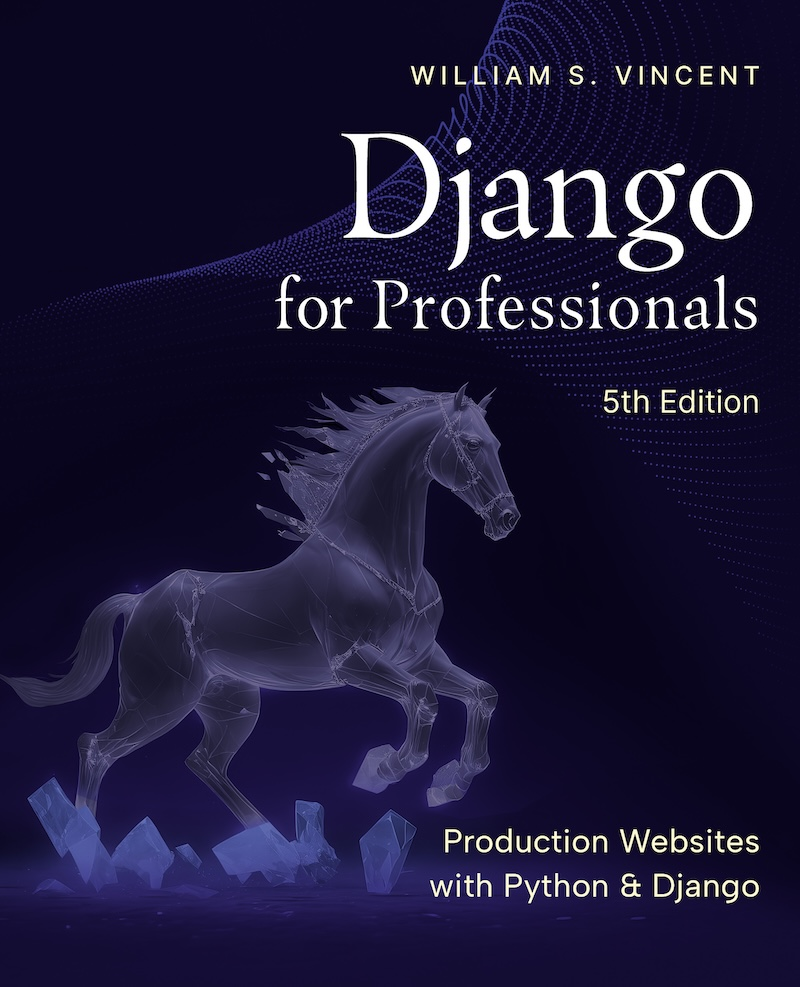

### Hi 👋

My name is Will Vincent. I'm a former [Django Board Member](https://www.djangoproject.com/foundation/), founder of [LearnDjango.com](https://learndjango.com/), and a Developer Advocate at [JetBrains](https://www.jetbrains.com/).

**📚 Books**

**📜 My latest blog posts:**
<!--START_SECTION:blog-posts-->
* [AI Thoughts in 2025](https:&#x2F;&#x2F;wsvincent.com&#x2F;ai-thoughts-in-2025&#x2F;)
* [PyCon US 2025 Recap](https:&#x2F;&#x2F;wsvincent.com&#x2F;pyconus-recap&#x2F;)
* [What’s Happening in Developer Tools? (OpenAI Just Bought Windsurf for $3B)](https:&#x2F;&#x2F;wsvincent.com&#x2F;whats-happening-in-developer-tools&#x2F;)
* [Vibe Recap of DjangoCon Europe 2025](https:&#x2F;&#x2F;wsvincent.com&#x2F;djangocon-europe-2025-recap&#x2F;)
* [Django for Data Science @ Boston Python Meetup](https:&#x2F;&#x2F;wsvincent.com&#x2F;django-for-data-science-boston-python&#x2F;)
<!--END_SECTION:blog-posts-->

**📰 Recent Django News Newsletter:**
<!--START_SECTION:news-->
* [Django News - DjangoCon US Early Bird Tickets - May 30th 2025](https:&#x2F;&#x2F;django-news.com&#x2F;issues&#x2F;287)
* [Django News - Django Sprints on the Med? - May 23rd 2025](https:&#x2F;&#x2F;django-news.com&#x2F;issues&#x2F;286)
* [Django News -  Django News is at PyCon US this weekend! - May 16th 2025](https:&#x2F;&#x2F;django-news.com&#x2F;issues&#x2F;285)
* [Django News - Python 3.14.0 beta is here - May 9th 2025](https:&#x2F;&#x2F;django-news.com&#x2F;issues&#x2F;284)
* [Django News - Template Tricks, DjangoCon Europe, and Community Wins - May 2nd 2025](https:&#x2F;&#x2F;django-news.com&#x2F;issues&#x2F;283)
<!--END_SECTION:news-->

**🎧 Recent Django Chat Episodes:**
<!--START_SECTION:chat-->
* [Django Deployments in 2025 - Eric Matthes](https:&#x2F;&#x2F;djangochat.com)
* [Event Sourcing - Chris May](https:&#x2F;&#x2F;djangochat.com)
* [DjangoCon Europe 2025 Recap](https:&#x2F;&#x2F;djangochat.com)
* [Coding with LLMs - Frank Wiles](https:&#x2F;&#x2F;djangochat.com)
* [PyCon US 2025 - Elaine Wong &amp; Jon Banafato](https:&#x2F;&#x2F;djangochat.com)
<!--END_SECTION:chat-->

**:octocat: GitHub Stats:**

  

**📫 How to reach out to me:**
- Connect on LinkedIn: [in/william-s-vincent/](https://www.linkedin.com/in/william-s-vincent/)
- Follow on Fosstodon: [@wsvincent](https://fosstodon.org/@wsvincent)
- Email: will at learndjango.com
- Follow on BlueSky: [@wsvincent.bsky.social](https://bsky.app/profile/wsvincent.bsky.social)