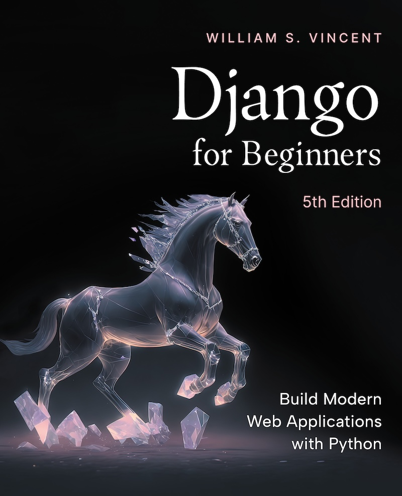

Hi, I'm Will Vincent, a Python Developer Advocate at [JetBrains](https://www.jetbrains.com/), [Python Fellow](https://www.python.org/psf/fellows/), and former [Django Board Member](https://www.djangoproject.com/foundation/).

- 📘 Wrote the book [Django for Beginners](https://learndjango.com/courses/django-for-beginners/)
- 🎓 Run [LearnDjango.com](https://learndjango.com/)
- 🎙️ Co-host the [Django Chat podcast](https://djangochat.com)
- 📰 Co-write the [Django News Newsletter](https://django-news.com)
- 🎤 Speak regularly at conferences, most recently [Modern Django Deployments in 2026](https://2026.djangocon.us/news/announcing-lineup/) at DjangoCon US and [Deploying Python Web Apps in 2026](https://wsvincent.com/deploying-web-apps-in-2026/) at EuroPython, plus [many previous talks](https://wsvincent.com/talks/)

You can read [a longer bio](https://wsvincent.com/about/) on my personal website if you're still curious.

  <!-- GitHub stars -->
  

  <!-- GitHub followers -->

  <!-- LinkedIn -->
  

